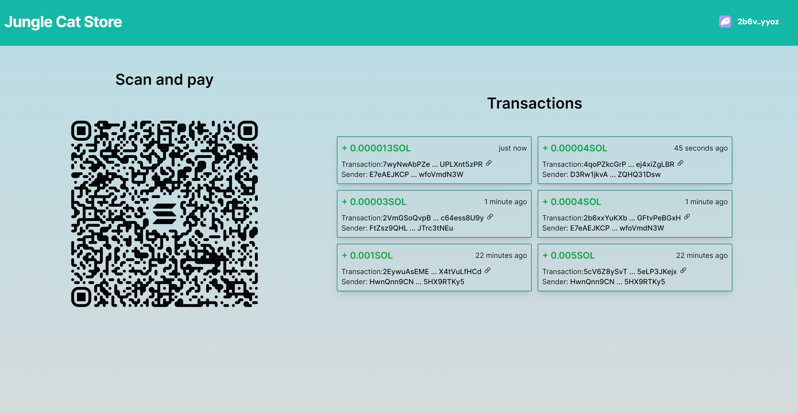

# [SolanaPay Payment Tracker for Marchants](https://track-transaction.vercel.app/)

This project is a web application that allows users to track and receive notifications for payments made to their Solana wallet. This project is useful for merchants who accept Solana payments and want to get notified without checking their wallet every time.



## Why would you build this?

 SolanaPay is a payment gateway for Solana that enables users to send and receive payments in SOL, the native cryptocurrency of Solana, or any other tokens built on the platform. However, SolanaPay does not provide a user-friendly interface for merchants who want to accept Solana payments and monitor their transactions. This project aims to fill this gap by providing a simple and intuitive web application that generates QR codes for Solana wallet addresses, subscribes to webhooks that listen to incoming transactions, plays sounds and displays cards when payments are received, and shows the history and details of each transaction.

## Features

- Connect your Solana wallet to the web application and automatically generate a QR code for your wallet address that can be scanned by other users to send you payments.
- Play a sound when a payment is received in SOL.
- View the cards history of payments received and the details of each transaction.

## How it works


- The project uses [Helius](https://www.helius.xyz/), a webhook service for Solana that allows users to subscribe to the trasaction events on the Solana network. For this project we will listening for transfer event. 
- The project uses [SolanaPay](https://solanapay.com/), for generating QR code for the connected wallet address.
- The project uses [Next.js](https://nextjs.org/), a React framework for building fast and scalable web applications with features such as server-side rendering, API routes and [Tailwind](https://tailwindcss.com/) for css.

## Installation

To run the project locally, you need to have the following prerequisites:

- Node.js and npm: You can download and install them from [here](https://nodejs.org/en).
- Solana wallet: You can create one using like [Phantom](https://phantom.app/).
- Helius account: You can sign up for free at [Helius](https://dev.helius.xyz/) and get an API key.

Once you have these ready, you can follow these steps to set up the project:

- Clone the repository from GitHub:

```bash
git clone https://github.com/vijay-kesanakurthi/solanapay-payment-tracker
```

- Install the dependencies:

```bash
cd solanapay-payment-tracker
npm install --force
```

- Set up the webhook:
  - Since we will be running our webhook locally (localhost:3000/webhook), we need a way to tell Helius how to send a request to our localhost. There are several ways to do this, but the easiest is to use [ngrok](https://ngrok.com/), a tool that creates a secure tunnel from a public URL to your localhost.
  - To use ngrok, you need to download and install it from [here](https://ngrok.com/). Then, run the following command in a terminal:

```bash
ngrok http 3000
```

  - This will generate a public URL that looks something like this:

```
Forwarding   https://5922-160-238-74-75.ngrok-free.app -> http://localhost:3000
```

  - Copy this URL, go to your [Helius dashboard](https://dev.helius.xyz/dashboard/app). Click on **Webhooks** and then **Create Webhook**. Give your webhook a name and paste the URL.
  


- Configure the environment variables:
  - Rename the `.env.local.example` file in the root directory of the project to `.env.local` and add the following environment variables:

```bash
HELIUS_API=your-helius-api-key
WEBHOOK_ID=your-webhook-id
```

- Run the development server:

```bash
npm run dev
```

- Open http://localhost:3000 in your browser to see the application.


## Usage

- To connect your Solana wallet to the web application, click on the "Connect Wallet" button on the homepage.t. A QR code for your wallet address will be generated automatically.
- To listen to incoming transactions to your wallet address, you do not need to do anything else. The web application will automatically start listening to the payments as soon as your wallet is connected. You will see a card and hear a sound when a payment is received in SOL. 
-  You can also click on each transaction ID to view more details on the Solscan.You can see last 10 trasactions after your walet connected.